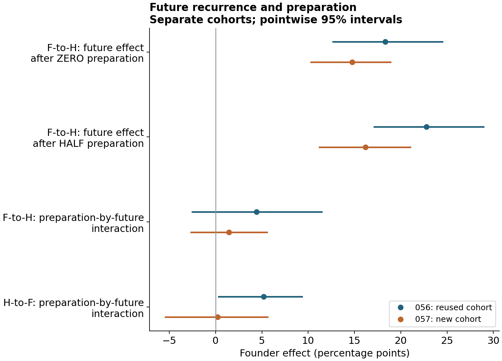

# Private memory, environmental recurrence and strategy transmission

**Environmental recurrence changes the transmission advantage of private memory in a finite-budget population model**  
Jack Chen · Research preprint v1.1.0 · 24 September 2026

**Archived publication:** [DOI 10.5281/zenodo.22930084](https://doi.org/10.5281/zenodo.22930084)

[Read the manuscript](paper/MANUSCRIPT.md) · [Download the manuscript PDF](paper/MANUSCRIPT.pdf) · [Supporting information](paper/SUPPLEMENT.md) · [Study and data index](provenance/STUDIES.json)

Historical information can help a strategy gain representation without guaranteeing survival or better terminal population performance. This repository reports that distinction in an abstract model of 32 binary states, inherited strategy labels, private one-record caches and equal objective-evaluation budgets.

The main results are:

- The historical-versus-fresh carrier ranking reverses between recurrent and independent targets; a separate cohort reproduces both directions and their interaction.
- Partial recurrence preserves a transmission advantage in several matched comparisons, including independently prepared direct competition. Many individual introductions still disappear, and costly introductions against non-retrieving residents often decline.
- Holding prepared populations fixed, future partial recurrence increases the matched historical-use founder effect: **+22.76 percentage points [17.12, 28.95]** in study 056 and **+16.20 [11.23, 21.02]** in the prospectively specified new cohort 057. Intervals are approximate pointwise 95%; cohorts are not pooled.
- Preparation moderation remains partly unresolved. Most individual introductions disappear. In the new partial-recurrence cohort, switching from historical to fresh use lowers the matched founder effect by **2.74 points** while raising terminal population accuracy by **0.32 points**. Strategy transmission and collective performance therefore retain separate conclusions.

These are model-specific simulation findings. They do not show that memory originates spontaneously, that costly memory generally invades, or that the mechanism has been demonstrated in biological organisms. This preprint has not undergone external peer review. See the [AI-assistance disclosure](docs/AI_ASSISTANCE.md).



## Verify the numerical release

```bash
python -m pip install -r requirements.txt
python scripts/verify_release.py
python scripts/reproduce_statistics.py
python scripts/rebuild_figures.py
```

The statistics script recomputes **15,053 means and intervals across 13 study grids** from the published block aggregates and stored bootstrap rows. It draws no random numbers and runs no new population paths. Studies share controls and cohorts as documented; 13 grids are not 13 independent replications.

| Directory | Contents |
|---|---|
| `paper/` | Manuscript and supporting information, readable source and PDFs |
| `figures/` | Thirteen scientific figures and the exact plotted statistics |
| `results/045`–`results/057` | Complete summaries, block aggregates, bootstrap rows, configuration and fate records |
| `code/045`–`code/057` | Archived scientific operators and analysis source for each study |
| `scripts/` | Release verification, statistical recomputation and figure/PDF generation |
| `provenance/` | Source mapping, original/exported hashes, study grid and prior reconstruction receipts |
| `docs/` | Analytical notes, scope, AI disclosure, licensing and data-availability boundaries |

This is a **compact evidence release**. It supports saved-table verification, figure rebuilding and code inspection. The multi-gigabyte raw trajectory and random-tape archives are not included; full raw-trajectory replay is not claimed. Details and implementation corrections are documented in the [supporting information](paper/SUPPLEMENT.md) and [data-availability statement](docs/DATA_AVAILABILITY.md).

## Citation and reuse

Use [CITATION.cff](CITATION.cff) for machine-readable citation metadata. Cite the archived version: [DOI 10.5281/zenodo.22930084](https://doi.org/10.5281/zenodo.22930084). This DOI identifies the v1.1.0 release. The earlier [v1.0.0 GitHub release](https://github.com/jackchenx3/private-memory-recurrence/releases/tag/v1.0.0) and [version 1.0 DOI](https://doi.org/10.5281/zenodo.22907237) remain unchanged. The earlier developmental-network manuscript is a separate work: [regulatory-mutation-options](https://github.com/jackchenx3/regulatory-mutation-options).

Manuscript, figures and original data: **CC BY 4.0**. Original code: **MIT**. Dependencies and cited works retain their own licenses. See [LICENSE](LICENSE), [LICENSE-CODE](LICENSE-CODE) and [LICENSE-CONTENT.md](LICENSE-CONTENT.md).
