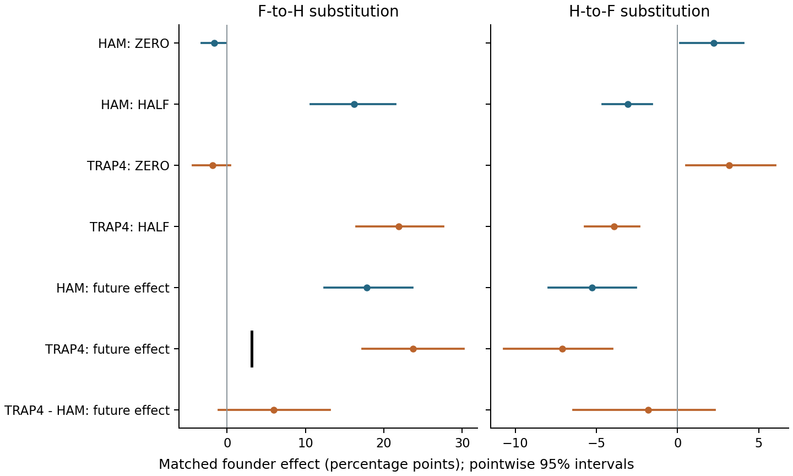

# Private memory, environmental recurrence and strategy transmission

**Environmental recurrence changes the transmission advantage of private memory in a finite-budget population model**  
Jack Chen · Research preprint v1.4.0 · 25 September 2026

**Archived publication:** [DOI 10.5281/zenodo.22949032](https://doi.org/10.5281/zenodo.22949032)

[Read the manuscript](paper/MANUSCRIPT.md) · [Download the manuscript PDF](paper/MANUSCRIPT.pdf) · [Supporting information](paper/SUPPLEMENT.md) · [Study and data index](provenance/STUDIES.json)

Historical information can help a strategy gain representation without guaranteeing survival or better terminal population performance. This repository reports that distinction in an abstract model of 32 binary states, inherited strategy labels, private one-record caches and equal objective-evaluation budgets.

The main results are:

- The historical-versus-fresh carrier ranking reverses between recurrent and independent targets; a separate cohort reproduces both directions and their interaction.
- Partial recurrence preserves a transmission advantage in several matched comparisons, including independently prepared direct competition. Many individual introductions still disappear, and costly introductions against non-retrieving residents often decline.
- Holding prepared populations fixed, future partial recurrence increases the matched historical-use founder effect: **+22.76 percentage points [17.12, 28.95]** in study 056 and **+16.20 [11.23, 21.02]** in the prospectively specified new cohort 057. Intervals are approximate pointwise 95%; cohorts are not pooled.
- Preparation moderation remains partly unresolved. Most individual introductions disappear. In the new partial-recurrence cohort, switching from historical to fresh use lowers the matched founder effect by **2.74 points** while raising terminal population accuracy by **0.32 points**. Strategy transmission and collective performance therefore retain separate conclusions.

- A fixed four-bit-trap challenge retains the future-recurrence contribution: **+23.74 points [17.26, 30.23]**, exceeding the separately specified one-expected-descendant benchmark. The direct trap-minus-Hamming contrast is **+5.92 [-1.06, 13.13]** and unresolved. Most introductions still disappear. This is one interacting objective, not a general ruggedness advantage.

- A one-update fresh-expression pulse leaves lasting population benefit unresolved: **+0.037 points [-0.247, 0.336]** relative to unchanged historical retrieval. Restoring retrieval improves later founder representation relative to continuous fresh expression by **2.995 points [1.465, 4.688]**, a separate secondary ancestry result. The same 192 prepared populations are reused with new transfer inputs; this is not independent training replication.

- Under one fixed bounded observation error, the founder noise-by-recurrence interaction remains **unresolved: +1.636 points [-2.604, 5.656]**. Exact and noisy founder recurrence effects are positive and exceed one expected descendant, while noise reduces absolute mean true population accuracy in both arms under both future laws. Terminal noise effects remain unresolved. These results do not establish equivalence; they reuse the exact-prepared 057 cohort.

These are model-specific simulation findings. They do not show that memory originates spontaneously, that costly memory generally invades, or that the mechanism has been demonstrated in biological organisms. This preprint has not undergone external peer review. See the [AI-assistance disclosure](docs/AI_ASSISTANCE.md).



## Verify the numerical release

```bash
python -m pip install -r requirements.txt
python scripts/verify_release.py
python scripts/reproduce_statistics.py
python scripts/rebuild_figures.py
```

The statistics script recomputes **15,284 means and intervals across 16 study grids** from the published block aggregates and stored bootstrap rows. It draws no random numbers and runs no new population paths. Studies share controls and cohorts as documented; 16 grids are not 16 independent replications.

| Directory | Contents |
|---|---|
| `paper/` | Manuscript and supporting information, readable source and PDFs |
| `figures/` | Seventeen scientific figures and the exact plotted statistics |
| `results/045`–`results/060` | Complete summaries, block aggregates, bootstrap rows, configuration and fate records |
| `code/045`–`code/060` | Archived scientific operators and analysis source for each study |
| `scripts/` | Release verification, statistical recomputation and figure/PDF generation |
| `provenance/` | Source mapping, original/exported hashes, study grid and prior reconstruction receipts |
| `docs/` | Analytical notes, scope, AI disclosure, licensing and data-availability boundaries |

This is a **compact evidence release**. It supports saved-table verification, figure rebuilding and code inspection. The multi-gigabyte raw trajectory and random-tape archives are not included; full raw-trajectory replay is not claimed. Details and implementation corrections are documented in the [supporting information](paper/SUPPLEMENT.md) and [data-availability statement](docs/DATA_AVAILABILITY.md).

## Citation and reuse

Use [CITATION.cff](CITATION.cff) for machine-readable citation metadata. Cite the archived version: [DOI 10.5281/zenodo.22949032](https://doi.org/10.5281/zenodo.22949032). This DOI identifies the v1.4.0 release. The previous [v1.3.0 DOI](https://doi.org/10.5281/zenodo.22939403), [v1.2.0 DOI](https://doi.org/10.5281/zenodo.22933218) and [v1.1.0 DOI](https://doi.org/10.5281/zenodo.22930084) remain unchanged. The earlier [v1.0.0 GitHub release](https://github.com/jackchenx3/private-memory-recurrence/releases/tag/v1.0.0) and [version 1.0 DOI](https://doi.org/10.5281/zenodo.22907237) remain unchanged. The earlier developmental-network manuscript is a separate work: [regulatory-mutation-options](https://github.com/jackchenx3/regulatory-mutation-options).

Manuscript, figures and original data: **CC BY 4.0**. Original code: **MIT**. Dependencies and cited works retain their own licenses. See [LICENSE](LICENSE), [LICENSE-CODE](LICENSE-CODE) and [LICENSE-CONTENT.md](LICENSE-CONTENT.md).
