# Environmental recurrence changes the transmission advantage of private memory in a finite-budget population model

**Jack Chen**

Frederick Sequencing and Genomics Core; Advanced Biomedical Computational Science (ABCS); Frederick National Lab for Cancer Research; National Institutes of Health.

Research preprint, version 1.4.0, 25 September 2026. Incorporates accepted study 060; earlier public versions remain unchanged. Computational study; not externally peer reviewed.

## Abstract

Using stored information may help a strategy spread without improving every population-performance endpoint. We distinguish these outcomes in an abstract 32-individual, 32-bit population model with private one-record memory, inherited strategy labels and an equal objective-evaluation budget. A historical probe and a fresh random probe occupy the same candidate slot. Their separate-introduction ranking reverses between alternating recurrent and independent targets, and an independent cohort reproduces both directions. Intermittent recurrence preserves a historical transmission advantage under two survival rules; direct competition and resident-policy preparation extend the comparison. A crossed experiment then holds prepared populations fixed while changing their future target law. After partial-recurrence preparation, future partial recurrence increases the matched historical-use founder effect by 22.76 percentage points relative to renewed targets (approximate pointwise 95% block-bootstrap interval, 17.12 to 28.95). A prospectively specified, independently generated cohort reproduces that direction, with 16.20 points (11.23 to 21.02), and also supports the corresponding contrast after renewed-target preparation. Cohorts are not pooled. A prospectively fixed challenge using new paired inputs retains a positive future-recurrence contribution under one four-bit-trap objective: 23.74 points (17.26 to 30.23), exceeding a separate one-expected-descendant benchmark. The direct trap-minus-Hamming difference remains unresolved; individual introductions still usually disappear. Preparation interactions remain partly unresolved. In the new partial-recurrence cohort, switching from historical to fresh use lowers the matched founder effect by 2.74 points while improving terminal population accuracy by 0.32 points; every introduced fresh-use founder nevertheless disappears in that sample. Fixed-cost introductions in earlier non-retrieving backgrounds often decline. Exact local calculations show why candidate-pair geometry does not determine global selection. A one-update fresh-exploration pulse leaves terminal population accuracy unresolved despite increasing founder representation relative to continuous fresh expression. A fixed bounded-error transfer challenge retains a positive founder recurrence effect while leaving its noisy-versus-exact change unresolved; noise lowers average population accuracy. These findings characterize conditional transmission of an available memory-use policy. They do not establish memory's spontaneous origin, equilibrium invasion, a general costly advantage, or measured biological effects.

## Introduction

Past solutions can provide useful candidates when an optimization problem changes. This is an established idea: Branke examined implicit and explicit memory in dynamic evolutionary algorithms, including circumstances in which memory helps and its potential adverse effects. [1]. Yang subsequently compared memory-based and other immigrant mechanisms across dynamic environments, including cyclic, noisy cyclic and random changes. [2]. The use of stored information and its dependence on environmental recurrence are therefore not new algorithmic ideas.

Evolutionary theories of inherited information address a related but different question: when does a transmission strategy itself spread? Kuijper and Johnstone modeled the evolution of parental effects and phenotypic memory under changing environmental conditions in a spatially structured population. [3]. Their framework supplies relevant precedent for environmental dependence of inherited information; it does not supply predictions for the finite candidate-selection process studied here.

We ask whether the use of an already available private memory increases carrier representation relative to allocating the same evaluation slot to fresh variation. Three distinctions organize the study. A strategy can outperform a comparator while declining in absolute frequency. It can gain representation while worsening a population-performance endpoint. A favorable local candidate statistic need not predict selection from the whole population. We evaluate these distinctions using matched computational budgets, separately identified independent cohorts, resident-state interventions, direct strategy competition and a control that retains historical distance while randomizing historical placement. The resident-policy comparison tests policy substitution with an unchanged-founder control in the identical starting population. A crossed follow-up varies the future target law at fixed prepared states to distinguish continued recurrence from preparation history. The contribution is this particular joint comparison and its limitations, rather than a claim that memory or recurrence-dependent adaptation was previously unknown.

## Model and study design

Each population contains 32 individuals represented by 32-bit states. At each of 40 updates, a binary target defines raw mismatch as Hamming distance in studies 045-057, 059-060 and the HAM arm of 058; the TRAP4 arm is defined below. Raw accuracy is one minus the mean mismatch divided by 32. A recurrent environment alternates two independent uniform targets; an independent-target environment draws a uniform target at each update. Paired laws share their first two targets, retaining chance equalities. Strategies receive no future target information.

An individual also carries an inherited strategy label, a founder identifier and, for a strategy carrier, a private one-record cache. In separate-introduction assays, one uniformly selected individual is initially a carrier, so initial frequency is 1/32. The direct-competition assay introduces one historical and one fresh carrier, each at 1/32, with opposite physical placements averaged within each continuation. Under the naive start all states are zero; the cache contains only the carrier's own current state and hence provides no initially useful historical alternative. There is no spontaneous type innovation or recombination. The experiment tests transmission of a supplied strategy, not its origin.

Every update generates four equally sized candidate families: current parents, probes, scouts and local descendants. Historical carriers express their cached state as the probe; fresh carriers express their current state XOR a uniform 32-bit mask. An unread sham retains the cache machinery but uses the current state as its probe. Resident probes also repeat their parent. All individuals produce a uniform-mask scout. A local descendant is generated from the best raw-scoring member of that parent's current/probe/scout set by independently flipping each bit with probability 1/32; zero and multiple flips are retained. Candidate ties follow frozen random priorities and deterministic index fallbacks.

All 128 candidates are evaluated and charged on every update, including duplicates. Global selection retains the best 32 according to mismatch plus a fixed carrier penalty, either zero or one bit. Strategy and founder labels follow the recipient parent. A surviving current parent retains its cache; a surviving nonparent carrier stores its recipient parent's current state. This update rule also applies to duplicate candidates. Equal objective-call budgets do not imply identical memory storage, candidate diversity, runtime or biological resource costs. The one-bit penalty is a scoring convention, not a calibrated energetic price.

The main transmission endpoint is D40, carrier frequency at update 40 minus its initial frequency. We compare historical and fresh policies through paired differences in D40. Historical absolute D40 tests mean increase; historical-minus-sham D40 tests the contribution of the retrieval policy relative to unread storage. We reserve retrieval-attributed mean increase for cases where both corresponding intervals are positive. Population performance is measured separately by mean post-selection raw accuracy across updates and by terminal raw accuracy. Neither replaces the transmission endpoint.

Each target cohort contains 24 independent blocks with eight paired continuations per block. Continuations are averaged within blocks; 2,000 whole-block bootstrap resamples give approximate pointwise 95% intervals. They do not provide simultaneous coverage across the many correlated comparisons. Positive and negative claims below require the relevant interval to exclude zero; intervals touching zero remain unresolved. All paths, including losses, ties, negative changes and missing crossings, are retained. Independent replication generates entirely new targets, continuation inputs, founder labels and bootstrap rows without pooling cohorts.

The resident-state study uses every zero-cost unread-sham endpoint from the independent cohort as a prepared population, without filtering on score, diversity or carrier fate. Founder identities are reset to current positions, a new single carrier is introduced and its cache again begins at its own current state. Matched naive controls and prepared populations share new future streams and labels. Recurrent futures continue the preparation pair; independent futures are renewed. Preparation lasts 40 updates and is not claimed to reach equilibrium. The prepared-minus-naive contrast directly tests initial-state moderation.

Finally, the distance control reads the current–cache Hamming distance, then draws a probe uniformly among states at that distance from the current parent. It preserves distance at each visited state, while randomizing placement. It still uses historical information through distance. It does not preserve the joint candidate pool or require paths to retain equal distances after they diverge. Its full-path contrast therefore measures a policy restriction, not a unique mediated fraction.

The intermittent-recurrence study holds the prepared recurrent states and first target pair fixed. From the third target onward, ZERO uses fresh uniform innovations, HALF copies its own lag-two target with probability one half and otherwise renews, and FULL retains exact alternation. A copied target can therefore be a previously refreshed parity target. The two new laws use frozen shared innovations and unchanged proposal streams; FULL reuses accepted exact-recurrence paths. Unconditionally, adjacent target pairs remain independent uniform under each law, while lag-two dependence differs. This is not exact matching of realized adjacent distances or independence from the prepared population. ZERO also differs from the earlier prepared-independent-target assay because its initial pair and preparation remain recurrent.

### Fully retrieving populations and resident-policy preparation

The fully retrieving experiments retain 32 individuals, 32 bits, the 40-update horizon and probabilistic survivor choice. All individuals use either historical retrieval (H) or fresh variation (F); F maintains the same cache but does not read it. Study 054 places one H among 31 F, or one F among 31 H, at each of two fixed physical positions, using all 192 prepared genotype arrays from study 052. Initial caches contain only their owner's current state. The two placements are paired treatments and are averaged before block-level inference. Common carrier costs shift every candidate's score equally in this all-carrier comparison, so only zero cost is simulated. This identity does not address a carrier-specific disadvantage against non-carriers.

Study 055 adds 40 updates of all-H or all-F resident preparation under each target law, starting from the same 192 source genotype arrays. This produces 1,152 unfiltered prepared populations. Each supplies three continuation treatments: no policy change, substitution at the first saved position, or substitution at the second. Genotypes and cache records are unchanged at substitution. Current positions are assigned new founder identifiers, with a complete map to preparation ancestry. Fresh-to-historical substitution activates use of an existing cache; it does not introduce a storage apparatus. The target process continues through preparation and transfer, rather than restarting its initial pair. New continuation inputs are fixed before preparation outcomes are available. The 3,456 transfers remain dependent on the reused source genotype cohort.

For each resident background, the primary matched effect is the substituted founder's frequency change minus the change of the same founder in the unchanged population, averaged over the two physical positions. Absolute substituted-founder change is reported separately. The five fixed study-055 criteria concern the partial-recurrence F-to-H effect, the reciprocal H-to-F effect, absolute changes in each direction, and the partial-minus-renewed F-to-H effect. Their intervals are individually pointwise; the conjunction is not a simultaneous-confidence claim. Cross-law comparisons change both resident preparation and continuation. Cross-background comparisons change resident genotypes and caches as well as policy composition, and comparisons of 054 with 055 do not isolate preparation alone.

### Separating preparation history from future recurrence

Study 056 completes a two-by-two design: ZERO or HALF resident preparation crossed with ZERO or HALF continuation. It reuses the 2,304 diagonal transfers from study 055 and generates 2,304 off-diagonal transfers from the identical saved populations, genotypes, caches, founder placements and random tapes. Each future target sequence follows its own law recursively from its actual preparation's last two targets. Targets are not spliced from another prepared history. No new cohort, preparation or random draw is introduced.

The primary contrast is the HALF-minus-ZERO future-law difference in the matched F-to-H founder effect, holding HALF preparation fixed. Its positive direction was specified before the new off-diagonal outcomes. The corresponding contrast after ZERO preparation, their interaction, reciprocal substitutions, absolute founder changes, and mean and terminal population accuracy remain separate endpoints. The compact catalog contains 18 metrics across nine groups, or 162 approximate pointwise intervals, with paired contrasts formed before the existing whole-block resampling. This is an exploratory extension selected after earlier results, not independent confirmation. It changes a future environment within this model; it does not identify a unique microscopic mechanism.

Study 057 prospectively tests the same primary and secondary future-law directions in a fully new simulated cohort. It retains the earlier three-stage distribution: 192 zero-start SHAM_C0 preparations under new alternating target pairs, 768 all-F/all-H policy preparations under new ZERO/HALF histories, and 4,608 crossed transfers. The first stage retains its original elitist survival; policy preparation and transfer retain the fixed probabilistic rule. All stages have 40 updates. The 3,193 seed records use a new frozen namespace and are checked for collisions with the recorded earlier inventory. New environmental draws, stage-specific tapes, physical placements and 2,000 bootstrap rows are generated before outcomes; all preparation endpoints are retained. The design has 5,568 scientific paths and 28,686,336 objective evaluations. The metric catalog, n=24 block unit, paired placement averaging and 162 pointwise intervals are unchanged. Neither the sample size nor the endpoint is adapted to the result. The original effect magnitude is context, not a replication threshold.

### A fixed interacting-objective challenge

Study 058 changes the objective in all three stages while retaining the established population operators. The paired objectives minimize Hamming loss (HAM) or a fixed four-bit-trap loss (TRAP4). Partition the 32 coordinates into eight consecutive four-bit blocks. If u bits in a block agree with its current target, the block loss is 0 when u=4 and 1+u otherwise; the table for u=0,1,2,3,4 is [1,2,3,4,0]. Sum these eight block losses. Both objectives range from 0 to 32 and have the target as their unique global optimum. TRAP4 has within-block interactions and strict suboptimal single-bit local optima. It introduces no learned landscape or fitted score coefficient.

Each objective has 192 new initial preparations and 384 new all-H/all-F policy preparations under HALF only, followed by 2,304 future ZERO/HALF transfers. Every stage has 40 updates. The 5,760 paths use 29,675,520 objective evaluations. All 3,193 seed IDs and input tapes are new relative to earlier cohorts. Objectives share indexed target, proposal, placement and survival inputs, with separate random families across stages. Each objective selects its own states at every stage; no HAM-prepared genotype array is supplied to TRAP4. Initial preparation remains elitist, and later survival uses weights 2^(-raw loss), with cost zero. Identical nominal score ranges do not imply equal selection intensity.

The frozen primary predicts a positive HALF-minus-ZERO contribution to the matched F-to-H founder effect under TRAP4, with HALF preparation fixed. Sign support requires a wholly positive approximate pointwise 95% block-bootstrap interval. Separately, a lower interval above 1/32 supports exceeding one additional expected descendant per introduced founder for this difference of matched effects. This benchmark defines a model scale, not biological importance. Two placements and then eight replicates are averaged within each of 24 independent blocks; 2,000 new common whole-block resampling rows form 114 fixed intervals. Six paired objective contrasts concern founder effects only. No cross-objective utility grid, alternative block size, sample extension or pooled old cohort is included. TRAP4 population utility is 1 minus mean trap loss/32, rather than matching-bit accuracy.

### A fixed one-update fresh-exploration pulse

Study 059 tests a temporal intervention on all 192 HALF-prepared, all-H populations from study 057, without filtering endpoints. It uses new HALF continuation targets, proposals, founder placements, survival tapes and bootstrap rows, while retaining the Hamming objective, zero cost, accepted candidate/cache operators and probabilistic survival weights. This is new transfer evidence on reused preparations, not a new independent preparation cohort. Target recursion continues from the actual last two preparation targets.

Five paths share indexed inputs within each replicate. STAY keeps H everywhere. PULSE0/PULSE1 substitute F at one of two preselected founder positions for exactly the first update. Immediately after that update's selection, every remaining F label changes to H, leaving genotypes, caches, founder identities and individual order unchanged. The remaining 39 updates use H everywhere. CONT0/CONT1 make the same initial substitutions and allow inherited F expression throughout. Pulse and continuous paths are identical through the first selection. The switch removes F expression, not founder descendants, and its type-frequency jump is recorded separately from selection.

The frozen primary is PULSE-minus-STAY terminal population accuracy. A strictly positive approximate pointwise 95% block-bootstrap interval supports its directional prediction. Separately, one additional expected matching bit across the 32-by-32 population-target comparisons equals 1/1024 accuracy, or 0.09765625 percentage points. This is a model resolution scale rather than a practical or biological threshold. Two placements and then eight replicates are averaged within each of 24 blocks; 2,000 new whole-block bootstrap rows give 36 fixed estimates. The 960 new paths use 4,945,920 objective evaluations. The pulse duration was fixed before new outcomes; no extinction-conditioned analysis, duration search or sample extension is used.

### A fixed bounded-error measurement interface

Study 060 holds all 192 HALF-prepared, all-F populations from study 057 fixed and crosses exact versus noisy transfer measurements with ZERO versus HALF future recurrence. It uses new targets, candidate and survival inputs, founder placements, noise and bootstrap rows. STAY keeps F everywhere; two paired SWITCH paths change only one preselected founder's policy to H, preserving its genotype, inherited cache, identity and order. Preparations used exact measurements and are reused without filtering. This is not independent training replication or a test of noisy historical preparation.

Each charged query computes true integer Hamming loss h once. EXACT returns h; NOISY returns h + (2u - 1), with its own frozen uniform draw u. The error magnitude is at most one raw mismatch unit, one bit. Duplicate genotypes are separately charged and measured; observations are not clipped. The same returned score controls donor choice and probabilistic survival. True loss is evaluator-only and is reused for performance diagnostics, with no extra query. Candidate and inherited-cache rules are unchanged. The real-score survival adapter uses race keys -log(v) times 2 raised to the observed score, preserving the earlier coefficient and tie order. Zero-error fixtures reproduce the accepted integer-score behavior.

The primary is the noisy-minus-exact change in the HALF-minus-ZERO matched H-founder effect at update 40. The prospective prediction is negative (attenuation). The separate resolution scale is plus or minus one expected descendant, 1/32 founder fraction; within-interface recurrence effects are compared with the positive one-descendant benchmark. Two placements and then eight replicates are averaged within each of 24 blocks. There are 2,000 new whole-block bootstrap rows and 81 fixed estimates, with approximate pointwise intervals. The 2,304 new transfer paths use 11,870,208 objective calls. No noise-level search, extra cohort or alternative endpoint is selected after outcomes.

## Results

### Opposite rankings repeat in an independent cohort

In the original cohort, zero-cost historical-minus-fresh D40 was +7.29 [+3.12, +11.98] percentage points under recurrence and -12.76 [-20.15, -5.89] under independent targets. Their direct recurrence-minus-independent interaction was +20.05 [+11.94, +28.97] points. Opposite within-law rankings are essential here: a positive interaction by itself would not establish a reversal.

The independent cohort reproduced both rankings: +12.50 [+7.29, +18.75] points under recurrence and -13.31 [-18.52, -7.81] under independent targets. The direct interaction was +25.81 [+17.71, +34.67] points. These are new task and continuation outcomes within the same model, not independent validation of the model itself. Mean raw-accuracy differences had the same within-law directions in both cohorts. The original independent-target terminal-accuracy difference remained unresolved; its counterpart in the new cohort was negative. Different significance labels do not by themselves establish a difference between cohorts.

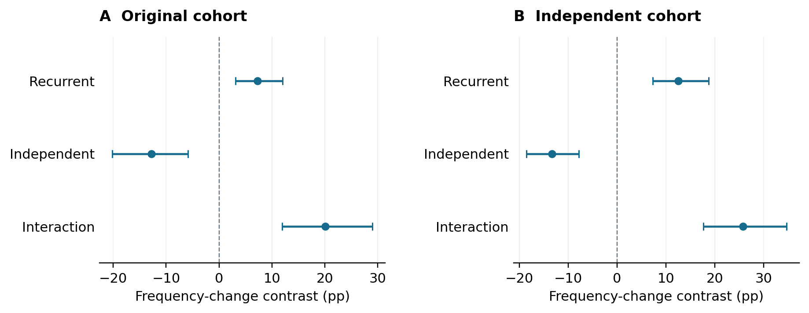

Figure 1. Zero-cost historical-minus-fresh carrier-change estimates and pointwise intervals. Interaction rows are recurrence-minus-independent differences of the paired policy contrast. The cohorts are shown separately and are not pooled.

### Mean spread coexists with frequent loss and costly decline

Under recurrence in the independent cohort, historical absolute D40 was +10.42 [+5.21, +16.67] points and its sham contrast was +8.25 [+3.12, +14.34] points. These support a separate retrieval-attributed mean increase. Fresh recurrence declined by -2.08 [-3.12, -0.52] points. Under independent targets both strategies increased in mean, but fresh variation increased more. Thus relative inferiority did not imply failure to spread.

Recurrent historical memory nevertheless disappeared in 166 of 192 independent-cohort introductions; the remaining 26 fixed. With the one-bit penalty, recurrent historical D40 was -2.08 [-3.12, -0.52] points: two fixations and 190 extinctions. The costly historical-minus-fresh difference touched zero and remained unresolved. A favorable zero-cost mean therefore does not establish typical survival or a costly advantage. For groups with no surviving blocks, the one-sided 95% upper bound on the probability that a new eight-continuation block contains any survivor is 0.11735. This is a block-event bound, not a per-lineage fixation probability, and all-extinction bootstrap intervals do not rule out unseen success.

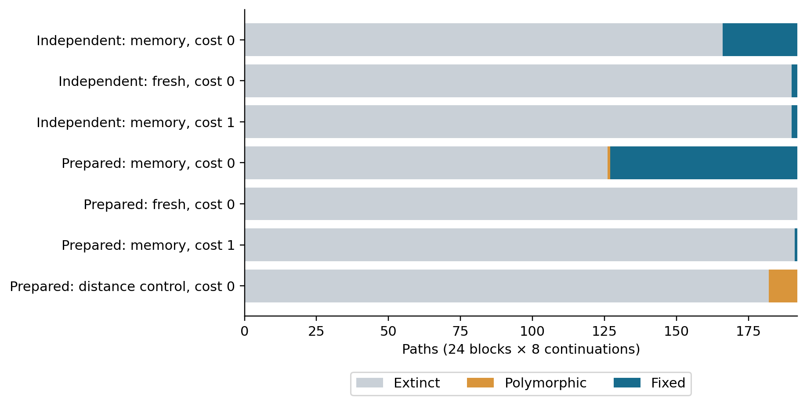

Figure 2. Counts among all 192 paths in each named group. Prepared groups are paired interventions on the independent cohort, not additional independent cohorts. The complete numerical fate table accompanies the figure; small polymorphic counts remain in the bars and table.

### Finite resident preparation strengthens the recurrent contrast

Prepared recurrent historical-minus-fresh D40 was +34.00 [+29.46, +38.98] points, compared with +14.06 [+8.32, +19.79] for its matched naive control. The direct prepared-minus-naive difference was +19.94 [+13.31, +26.86] points. The state intervention strengthens the total recurrent policy contrast; comparing the prepared estimate with the earlier cohort's estimate would not be the same paired test.

Prepared recurrent history also increased absolutely by +30.88 [+26.33, +35.86] points and exceeded unread sham. All prepared recurrent fresh introductions disappeared. Historical memory had 126 extinctions, 65 fixations and one polymorphic endpoint. Under prepared independent targets, history still lost to fresh variation. The fixed-cost historical recurrent change remained negative, -2.60 [-3.12, -1.56] points, with one fixation and 191 extinctions. Finite preparation does not remove the cost limitation or establish equilibrium invasion.

The first prepared recurrent update already favored history over fresh variation in carrier representation, while historical and sham candidates were still identical because their caches contained only current states. That immediate difference cannot be attributed to useful historical retrieval. Later historical-minus-sham evidence addresses retrieval separately. The state intervention changes the full evolutionary trajectory and does not isolate a unique mechanism or per-carrier selection coefficient.

### Historical placement adds value beyond distance under recurrence

Prepared recurrent historical-minus-distance-control D40 was +31.69 [+26.99, +36.69] points. Mean and terminal population accuracy also favored historical placement. Under prepared independent targets, the carrier comparison reversed to -6.12 [-11.62, -1.30] points, and both accuracy comparisons were negative. The naive independent-target comparisons remained unresolved, rather than demonstrating equivalence.

The distance control retained a positive prepared recurrent carrier advantage over fresh variation, but its absolute mean change and sham contrast were unresolved. Thus the residual relative advantage does not demonstrate mean spread or a population-accuracy benefit. Every cost-one distance-control absolute change was negative, and none of the four costly historical-minus-distance carrier contrasts established superiority. The distance restriction uses stored information and changes subsequent population states; its contrast cannot be interpreted as a uniquely quantified causal share of historical direction.

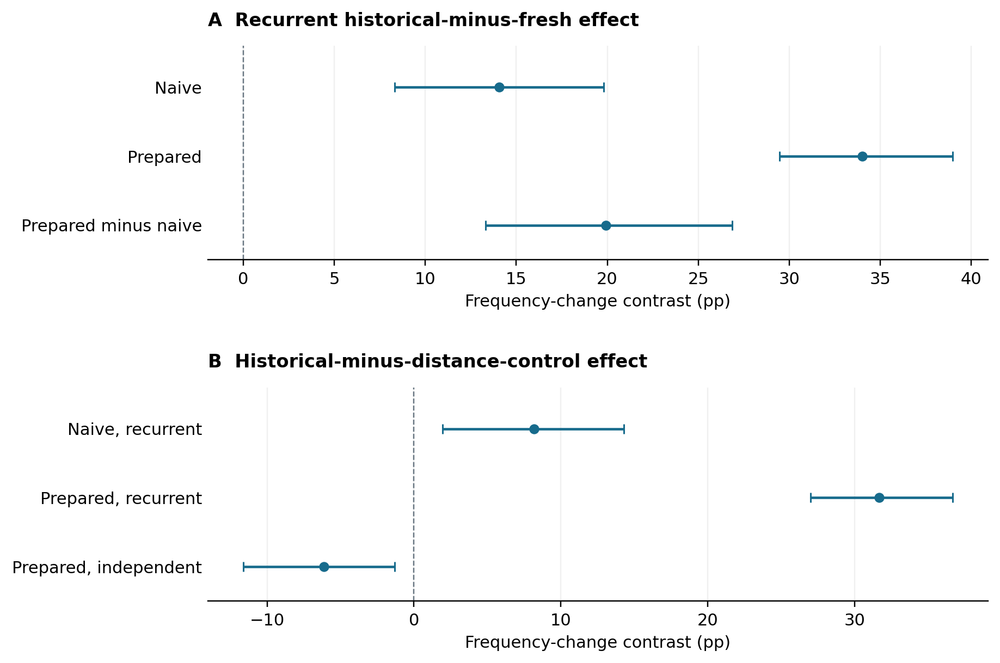

Figure 3. Direct state moderation and selected distance-control comparisons, with pointwise intervals. Rows compare the named policies or the difference between matched starting conditions; they are dependent contrasts, not independent replications.

### Transmission and population accuracy can disagree

Under prepared independent targets, historical-minus-sham carrier change was +4.36 [+0.52, +8.40] points, but terminal raw accuracy was -0.22 [-0.46, -0.00] points. The negative accuracy interval's unrounded upper endpoint is approximately −0.000483 points, close to zero; this remains an approximate pointwise result. Under naive recurrence, distance-control-minus-fresh carrier change was +5.88 [+2.60, +9.67] points while terminal accuracy was -0.23 [-0.47, -0.04] points. These contrary endpoint results preclude substituting transmission for collective performance.

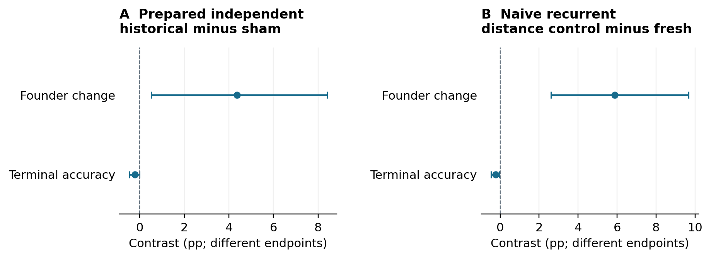

Figure 4. Selected endpoint disagreements retained in the main text. Both endpoints use percentage-point units but measure different quantities. Numerical estimates and full-precision intervals are available in the supporting summaries.

### A carrier advantage persists with intermittent recurrence

Under the fixed one-half copying law, historical-minus-fresh carrier change was +10.35 [+5.21, +15.62] percentage points. The direct HALF-minus-ZERO interaction was +10.50 [+3.94, +17.56] points. This separate interaction supports an incremental effect beyond the shared first target pair; a positive HALF contrast alone would not establish that attribution. Historical absolute change was +9.31 [+4.69, +14.32] points and its sham contrast was +9.83 [+5.14, +14.59] points, satisfying the distinct mean-increase and retrieval-attribution criteria.

The performance endpoints again diverged: historical-minus-fresh mean raw accuracy was +0.16 [+0.06, +0.26] points, whereas terminal raw accuracy was -0.37 [-0.71, -0.05] points. The gain in representation therefore coexisted with worse terminal population accuracy. ZERO carrier ranking was -0.15 [-4.90, +4.25] points and remained unresolved. FULL-minus-HALF carrier contrast was +23.65 [+17.01, +30.36] points. This establishes attenuation for that comparison, not a universal monotone response or a crossover probability.

Among 192 intermittent zero-cost historical introductions, 168 disappeared, 23 fixed and one remained polymorphic. Fresh variation had 188 extinctions and four fixations. All intermittent cost-one paths ended extinct, preserving the fixed-cost limitation. The known preparation cohort and shared initial pair remain part of the treatment context. The sampled adjacent-target mean distances were 16.01, 16.06 and 17.63 bits for ZERO, HALF and FULL respectively; their identical unconditional law does not require those finite samples to coincide. No policy observed future targets or the copying labels.

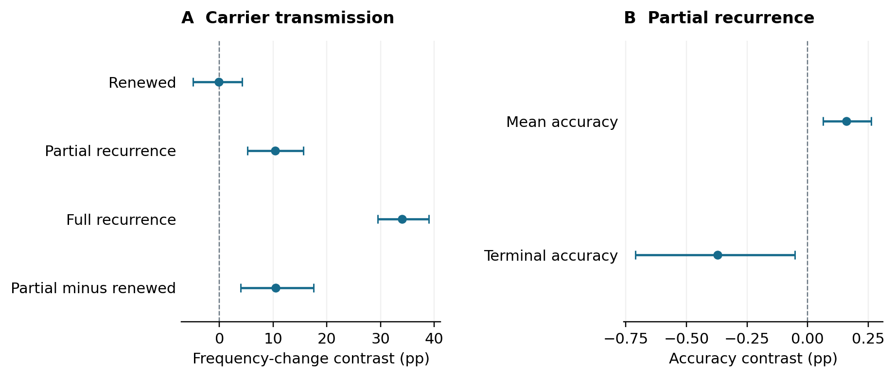

Figure 5. Historical-minus-fresh contrasts under three target processes, plus the direct intermittent-minus-renewal interaction (A), and intermittent mean versus terminal raw accuracy (B). All intervals are approximate pointwise. The FULL paths are stored controls; panels share the same preparation cohort and are not independent replications. Complete adverse outcomes and both arms are retained in the supporting summaries.

### Probabilistic survival preserves the intermittent advantage

We replaced global best-32 selection with weighted sampling without replacement while preserving all candidate-generation and inheritance rules. Each candidate with integer penalized Hamming score s received weight 2^(-s); the 32 smallest exponential clocks, −log(U)·2^s, survived in clock order. This is an established weighted-sampling construction ([Efraimidis and Spirakis, 2006](https://www.sciencedirect.com/science/article/pii/S002001900500298X)). The saved finite uniform grid approximates its ideal continuous law. The fixed score-to-weight convention was not calibrated biologically or tuned to outcomes. Duplicate genotypes remained distinct candidate slots, and negative raw or penalized selection improvement remained valid.

Under intermittent recurrence, historical-minus-fresh carrier change was +13.85 [+8.12, +20.18] percentage points, and the separate HALF-minus-ZERO interaction was +13.20 [+5.58, +21.80] points. Historical absolute change was +11.51 [+5.78, +17.90] points and historical-minus-sham change was +12.55 [+6.77, +19.12] points. Both mean increase and its retrieval attribution therefore persisted under this specified alternative. Fresh carrier change was -2.34 [-3.12, -1.04] points.

The direct probabilistic-minus-deterministic moderation of the intermittent carrier contrast was +3.50 [-3.71, +11.31] points and remained unresolved. Under full recurrence, however, this moderation was -11.34 [-18.38, -3.86] points, negative. Persistence of an advantage is consequently narrower than invariance to selection rule or equality of effect sizes.

Historical-minus-fresh mean accuracy under probabilistic intermittent survival was +0.14 [+0.06, +0.24] points; terminal accuracy was -0.02 [-0.45, +0.42] points and remained unresolved. The stored deterministic terminal disadvantage was retained. Its direct moderation was +0.35 [-0.22, +0.92] points and unresolved, so different significance labels do not establish different terminal effects. Of 192 zero-cost historical introductions, 162 disappeared, 26 fixed and four remained polymorphic. Fresh variation had 189 extinctions, one fixation and two polymorphic endpoints. Every costly introduction in this first-position probabilistic-survival panel disappeared under all three target laws.

This study added 3,456 paths and authenticated 3,456 stored controls on the same prepared cohort and target panel. It broadened the survival operator without providing an independent preparation replication. A cross-platform logarithm discrepancy of at most one binary64 unit was handled in a separate preserved validator; all saved and recomputed survivor indices and their order agreed exactly. No scientific trajectory was rerun or changed.

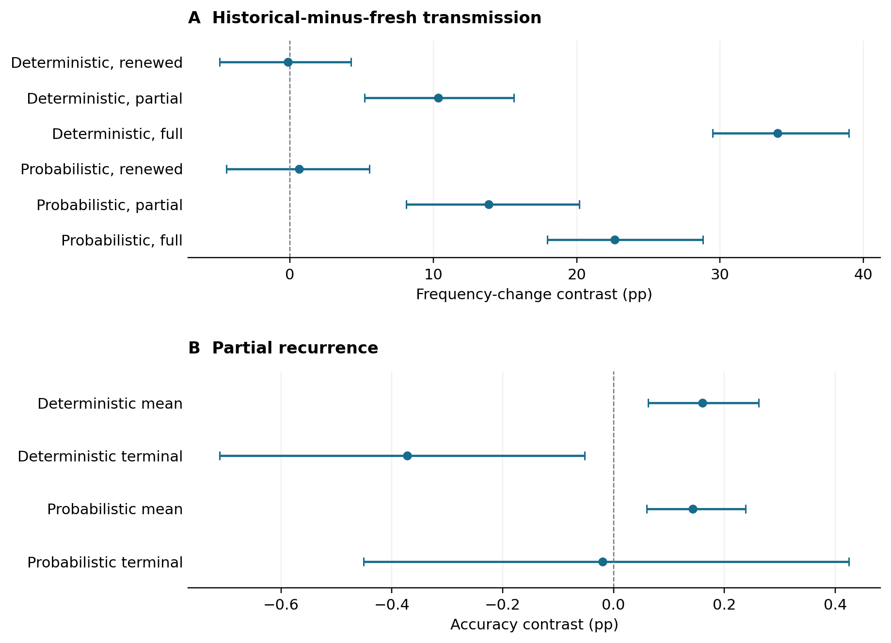

Figure 6. Historical-minus-fresh carrier-change contrasts across three target processes (A) and intermittent population-accuracy contrasts (B). Intervals are approximate pointwise. The two survival rules use matched preparation and proposal inputs; deterministic results are reused controls. Direct rule interactions, rather than comparisons of significance labels, support the stated moderation findings. Complete fate and adverse-outcome records remain in the supplement.

### Historical memory retains its advantage when strategies compete together

We introduced one historical carrier and one fresh carrier into the same prepared population with 30 residents, using two opposite assignments to the first two positions in a frozen founder permutation. Matched isolated controls introduced each strategy separately at each position with 31 residents. Initial genotypes, targets, all proposal streams and the probabilistic survival rule were shared. Position averages were computed within each continuation before block resampling; they did not double the number of independent replicates.

The prospectively fixed intermittent zero-cost historical-minus-fresh D40 contrast was +11.37 [+8.39, +14.14] percentage points. Historical absolute change was +8.80 [+5.74, +11.82] points, while fresh absolute change was -2.57 [-3.12, -1.81] points. The separate HALF-minus-ZERO ranking contrast was +14.46 [+9.92, +18.56] points. Thus direct ranking, historical mean increase and incremental recurrence attribution were individually supported. The direct mixed-minus-isolated ranking moderation was -2.44 [-5.76, +0.86] points and unresolved. Because this comparison changes both carrier composition and density, it does not isolate a unique interaction mechanism.

ZERO's mixed ranking remained unresolved at -3.09 [-6.61, +0.42] points. Its composition moderation was negative, -2.43 [-4.79, -0.02] points, with an unrounded upper endpoint of about −0.0163 points; that narrow pointwise result does not establish a reversed ZERO ranking. Under full recurrence the mixed historical advantage was +22.62 [+19.14, +25.87] points. All three laws reuse the known prepared cohort.

The mixed population has one shared collective-accuracy trajectory. Under intermittent recurrence, its mean advantage over isolated fresh variation was +0.09 [+0.05, +0.14] points, but its terminal difference was +0.03 [-0.15, +0.19] points and unresolved. Both mean and terminal comparisons with isolated historical memory were unresolved. Stronger historical representation therefore does not establish a general endpoint-performance advantage.

Of 192 paths per placement, historical memory disappeared in 165 and 170; it fixed in 23 and 19 and remained polymorphic in four and three. Fresh variation disappeared in 191 and 190. Both strategies were never present together at the final update in this sample. All costly mean carrier changes were negative, but full recurrence retained one historical fixation in MIX1 and one in H1, on different continuations. Full-recurrence mixed historical change was -2.86 [-3.12, -2.34] points. These rare successes do not reverse the negative mean or provide independent replications.

The assay added 4,608 new paths and authenticated 2,304 first-position controls. No new seeds or resident preparations were generated. A failed negative-accuracy fixture was corrected before scientific propagation, with its full failure record preserved and no change to the model or protocol. The complete new paths and all 1,482 pointwise intervals were independently reconstructed. This establishes the direct comparison on a reused cohort; the independent-preparation test is reported next.

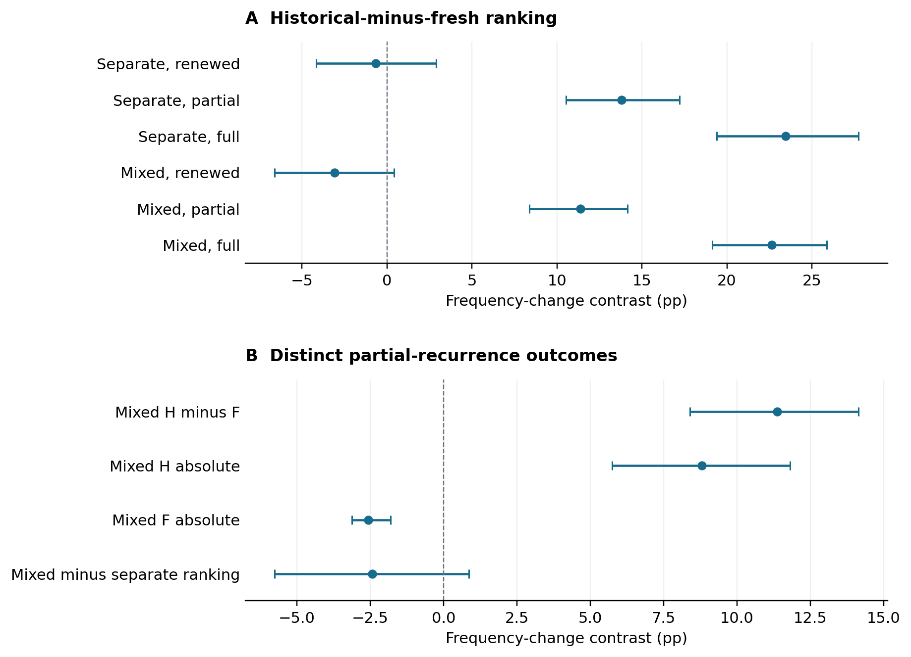

Figure 7. Zero-cost historical-minus-fresh carrier ranking across target processes in mixed versus separate populations (A), and the distinct intermittent ranking, absolute changes and composition moderation (B). Intervals are approximate pointwise. Both initial founder orientations contribute within each of the 192 continuations. Positive mean change coexists with frequent extinction; the complete endpoint table and adverse outcomes are retained in the supplement.

### Independently prepared populations reproduce the direct-competition pattern

We prospectively repeated the direct-competition primary and two separate companion predictions using 24 new recurring-target pairs and eight new preparation continuations per pair. Each preparation started from 32 all-zero genotypes and underwent the unchanged 40-update resident-equivalent preparation rule. Every endpoint was retained in physical order; strategy labels, founder IDs and caches were reset before transfer. Each transfer began with its own preparation pair. All 1,993 target, preparation, transfer and bootstrap seed streams were new. Source and exogenous inputs were frozen before preparation, and all resident endpoints were frozen before transfer. No outcome filtering or cohort pooling was used.

The intermittent zero-cost historical-minus-fresh endpoint-frequency contrast was +13.83 [+10.00, +17.82] percentage points. Absolute historical change was +11.12 [+7.47, +15.05] points, and HALF-minus-ZERO ranking was +13.18 [+8.49, +18.11] points. All three fixed directional criteria were met separately. Fresh absolute change was -2.71 [-3.12, -2.03] points. The conjunction reproduces the specified pattern; it does not provide simultaneous interval coverage or support beyond this design.

Mixed-minus-isolated ranking moderation under intermittent recurrence remained unresolved, +2.59 [-0.14, +5.36] points. Under full recurrence it was positive, +3.55 [+0.94, +6.08] points. The latter result was unresolved in the earlier cohort; differing significance labels do not establish a cohort difference. ZERO's direct ranking was +0.66 [-2.07, +3.49] points and unresolved. The old and new cohorts remain separately reported.

Intermittent mixed-minus-isolated-fresh mean accuracy was +0.15 [+0.08, +0.24] points, positive, while terminal accuracy was +0.09 [-0.20, +0.43] points and unresolved. Mean and terminal comparisons with isolated historical memory were both unresolved. Most historical introductions still disappeared: 161 and 167 of 192 paths in the two placements, with 26 and 24 fixations and five and one polymorphic endpoints. Fresh carriers disappeared in 191 paths in each placement. No mixed endpoint retained both policies. The primary's position-averaged individual contrasts included 51 positive, one negative and 140 ties.

All costly mean carrier changes were negative. Intermittent mixed historical change was -2.86 [-3.12, -2.34] points. One historical fixation occurred in each of the mixed and isolated first-position treatments, on the same starting continuation (block 16, continuation 0), reaching fixation at update 12. These are two matched treatments, not independent replications; all other costly endpoints were extinct. Earlier costly successes in different blocks remain preserved in their original cohort. Rare successes do not overturn the negative means.

The study added 192 preparation paths and 6,912 transfer paths. Independent reconstruction verified every preparation and transfer, all unfiltered endpoint/reset identities and the complete 1,482-interval grid. This addresses the independent-preparation gap for the specified direct-competition result. It does not resolve the separate limitation that mixed-versus-isolated comparisons change initial carrier density and competitor identity together.

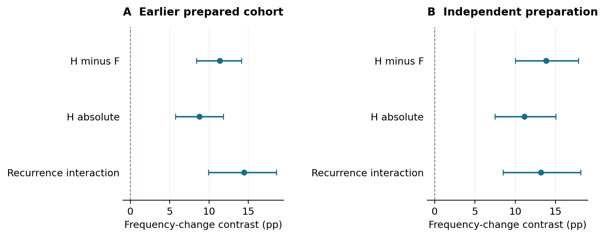

Figure 8. Separate estimates for the earlier and independently prepared cohorts. All three prospectively specified contrasts are positive in each cohort under approximate pointwise 95% intervals. No pooled estimate or cross-cohort test is shown. A positive average coexists with frequent extinction, negative costly means and unresolved terminal collective-performance comparisons.

### Historical policy retains its advantage against each common competitor

We added two historical carriers (HH) or two fresh carriers (FF) to the independent prepared cohort, reusing its mixed historical/fresh placements (HF). Each population initially contained two carriers and 30 non-retrieving residents. This holds initial carrier density fixed while comparing a historical focal founder with a fresh focal founder facing the same competitor policy. Physical founder positions are paired and then averaged within each continuation. A single HH or FF trajectory supplies both founder frequencies; their mean is exactly half its total carrier frequency, without assuming exchangeability. Founder ancestry remains distinct from expressed policy.

Under intermittent recurrence at zero cost, historical-minus-fresh founder change was +11.51 [+8.28, +14.73] percentage points against a historical competitor and +13.40 [+9.72, +17.23] points against a fresh competitor. Both predeclared directional criteria were met separately. Their difference was -1.89 [-3.83, -0.07] points, with no interaction sign prescribed. Both focal contrasts were also positive under full recurrence and unresolved under renewed targets. The direct intermittent-minus-renewed contrasts were +11.72 [+7.10, +16.18] and +12.29 [+8.42, +16.85] points.

The interaction equals the mean of the two homotypic total-carrier frequencies minus the mixed total-carrier frequency. Its negative value describes total finite-path nonadditivity, with the upper interval endpoint close to zero; it does not identify a unique microscopic competition mechanism. Nor does it say that HF exceeds HH. Historical absolute founder changes were +8.80 [+5.73, +11.90] points against H and +11.12 [+7.47, +15.05] against F. Fresh changes were -2.71 [-3.12, -2.03] against H and -2.27 [-3.02, -1.40] against F. The historical gains and fresh declines were separately supported.

Mean population accuracy followed HH>HF>FF under intermittent recurrence: HH-minus-HF was +0.15 [+0.07, +0.23], HH-minus-FF +0.35 [+0.21, +0.51], and HF-minus-FF +0.21 [+0.11, +0.31] percentage points. All three terminal comparisons remained unresolved. All costly absolute founder and total-carrier mean changes remained negative. One costly historical founder fixed in both HH and the first mixed placement on the same block 16, continuation 0; these are matched treatments, not independent successful events.

The primary included 48 positive, two negative and 142 tied continuation contrasts. At zero cost under intermittent recurrence, the two HH founders disappeared in 166 and 170 of 192 paths; each FF founder disappeared in 190. No intermittent endpoint retained both founders. Three other endpoints retained two founders while their shared policy fixed, demonstrating why policy and founder fixation must be distinguished. This study adds 2,304 paths and authenticates 2,304 stored mixed paths. It extends the same prepared cohort, not the number of independent replications. It motivates the full-carrier and resident-policy experiments reported next.

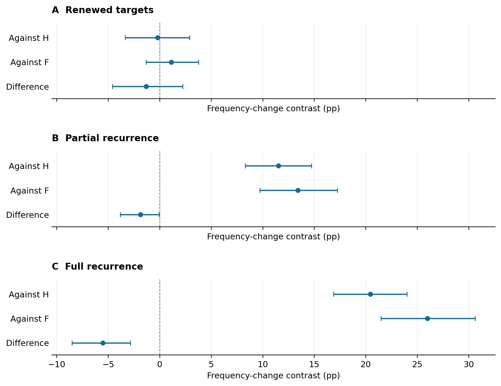

Figure 9. Historical-minus-fresh endpoint-frequency changes against each fixed competitor, and their direct difference, at zero cost. Every population begins with two carriers among 32 individuals. Intervals are approximate pointwise 95% block-bootstrap intervals; the difference is total-carrier nonadditivity and has no prescribed sign. Costly declines, frequent lineage loss and unresolved intermittent terminal population comparisons remain in the complete results.

### Rare historical users can increase in fully retrieving populations

Under partial recurrence in study 054, a rare H founder increased by +36.61 [+27.54, +45.83] percentage points from an initial 3.125%, whereas rare F changed by -3.12 [-3.12, -3.12] points. Every sampled rare-F endpoint was extinct. The partial-minus-renewed rare-H change was +36.57 [+26.83, +46.49] points. The two renewed-target rare-policy changes remained unresolved. Full recurrence also supported mean H increase and F decline.

Favorable mean H change did not imply typical survival: 119 of 192 H introductions disappeared at the first position and 110 at the second under partial recurrence. These matched positions do not supply 384 independent observations. An empirical all-extinction interval for rare F describes the observed sample, not an impossibility of future success. Policy fixation can retain several founders and is distinct from fixation of one lineage.

Populations initially containing rare H had lower mean raw accuracy than populations initially containing common H under partial recurrence: -0.71 [-0.87, -0.58] points. Their terminal comparison, -0.08 [-0.73, +0.56], was unresolved. The corresponding full-recurrence terminal contrast was negative. Greater change from a much lower starting frequency also did not mean a greater final H frequency. This comparison removes non-retrieving residents and changes policy frequencies together; it is not a pure frequency intervention relative to the earlier low-carrier-density assays.

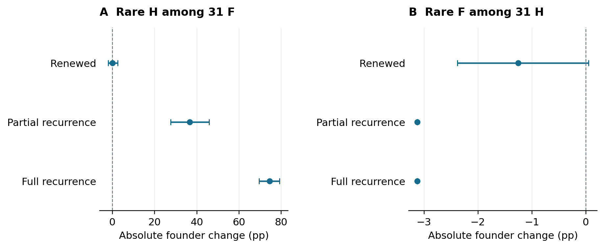

Figure 10. Absolute rare-H and rare-F founder changes in study 054. Both start at 1/32, in opposite majority backgrounds. Intervals are approximate pointwise 95% block-bootstrap intervals. The degenerate rare-F intervals under partial and full recurrence retain every observed loss; they do not rule out unobserved survival. Cohort and proposal inputs are reused from study 052.

### Historical use retains an advantage after resident-policy preparation

In study 055, the partial-recurrence F-to-H matched effect was +21.18 [+16.36, +26.35] percentage points. The reciprocal H-to-F effect was -2.79 [-4.75, -1.03] points. Historical substitution also increased absolutely by +20.55 [+15.82, +25.65] points, reaching 23.67% mean founder frequency from 3.125%; fresh substitution changed by -2.86 [-3.12, -2.34] points. The direct partial-minus-renewed F-to-H effect was +21.95 [+16.91, +27.14] points. All five fixed directional criteria were supported separately.

Environmental dependence remained. With renewed targets, the F-to-H effect was -0.77 [-2.43, +0.80] and unresolved, while H-to-F was +5.41 [+3.04, +7.74] and positive. Full recurrence supported F-to-H benefit and H-to-F harm. This is not the same reversal claim as the independently replicated separate-introduction experiment: the resident backgrounds and intervention differ, and the renewed-target F-to-H interval here includes zero.

Most introduced H founders still disappeared: 145 of 192 at the first position and 147 at the second under partial recurrence, with 45 and 44 fixations respectively. The primary paired effects comprised 75 positive, 13 negative and 104 tied continuations; all 24 block means were positive. A contrary fresh-founder fixation is retained: in the second H-to-F placement, block 8, continuation 1 (zero-based identifiers), the introduced F lineage fixed at update 14. The other 191 introductions at that placement and all 192 at the first placement disappeared. Mean disadvantage therefore does not entail inevitable individual loss.

Population accuracy again requires its own conclusion. Under partial recurrence, F-to-H improved mean accuracy by +0.30 [+0.16, +0.46] points, but its terminal effect, +0.33 [-0.08, +0.77], remained unresolved. H-to-F lowered mean accuracy by -0.11 [-0.21, -0.02] points, while its terminal effect, -0.34 [-0.79, +0.12], was also unresolved. The experiment supports conditional finite-horizon transmission after resident-policy preparation, not equilibrium invasion or a guaranteed terminal adaptation benefit.

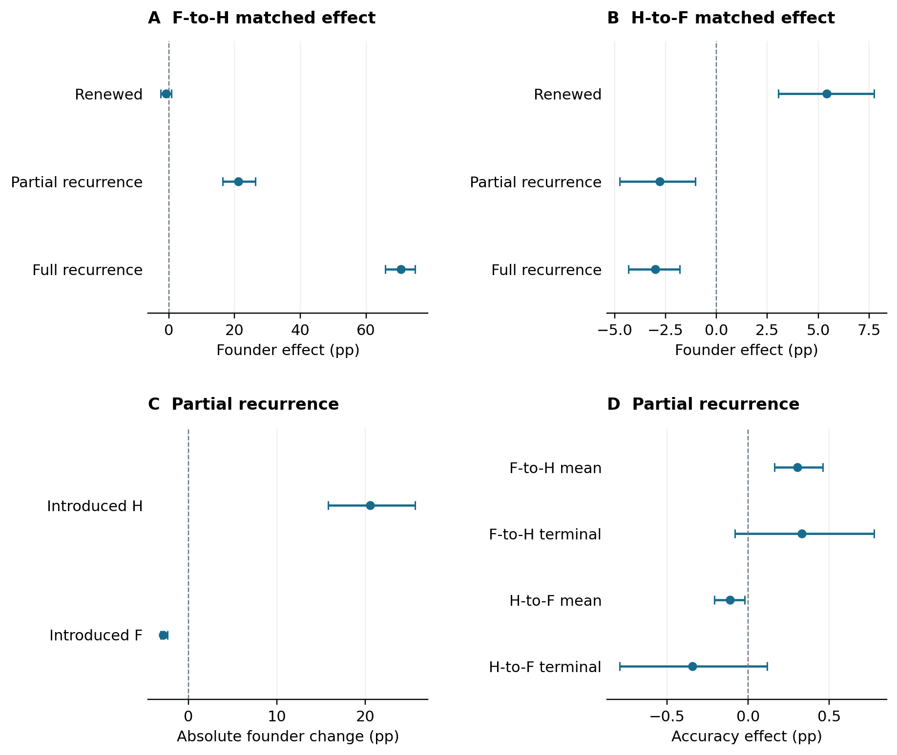

Figure 11. Study 055 separates matched substitution effects, absolute introduced-founder changes, and population performance. F-to-H and H-to-F occur in different prepared backgrounds. The bottom-right panel contains only partial-recurrence collective outcomes; mean accuracy and terminal accuracy are distinct endpoints. All intervals are pointwise. New preparations and continuations reuse the study-052 genotype cohort, so this is not an additional independent preparation replication.

### Future recurrence contributes at fixed prepared states

With HALF-prepared populations held fixed, continuing under HALF instead of ZERO raised the matched F-to-H founder effect by +22.76 [+17.12, +28.95] percentage points in study 056. The F-to-H effect itself was +21.18 points under HALF continuation and -1.59 [-3.17, -0.11] under ZERO continuation. Thus the tested prepared populations did not retain their positive relative benefit after a change to the independent-target future. After ZERO preparation, the corresponding future-law effect was +18.33 [+12.70, +24.47] points. These comparisons identify future-environment dependence without relying on the earlier diagonal contrast, which changed preparation and continuation together.

The primary comprised 84 positive, 14 negative and 94 tied paired continuation outcomes; all 24 block means were positive. Founder loss remained common. At the first F-to-H placement, 145 of 192 founders disappeared under HALF preparation/HALF continuation and 190 disappeared under HALF preparation/ZERO continuation. Positive mean transmission advantage therefore does not establish reliable establishment of an individual introduction.

Preparation moderation of the F-to-H future effect was +4.44 [-2.50, +11.47] points and unresolved. This is not equivalence or evidence that preparation is irrelevant. The reciprocal H-to-F interaction was +5.18 [+0.31, +9.31] points, and its preparation contrast at fixed ZERO future was -4.14 [-7.37, -0.21] points. These additional pointwise findings limit a blanket claim that only the future matters.

For F-to-H substitution, the future-law effect on mean population accuracy was +0.18 [+0.11, +0.27] accuracy points after ZERO preparation and +0.31 [+0.17, +0.46] after HALF preparation. The terminal-accuracy future contrast was unresolved after ZERO preparation, +0.25 [-0.11, +0.61], and narrowly positive after HALF preparation, +0.4153 [+0.0013, +0.8215]. These differences of effects are distinct from the HALF/HALF base terminal effect, which remains unresolved as reported for study 055. The full grid retains all 73 positive, 16 negative and 73 unresolved intervals.

### A prospective test in a new simulated cohort

Study 057 reproduced the prespecified positive directional criterion. In newly generated HALF-prepared populations, the future HALF-minus-ZERO contribution to the matched F-to-H founder effect was +16.20 [+11.23, +21.02] percentage points. The separate secondary prediction after ZERO preparation reproduced the prespecified positive directional criterion, with +14.75 [+10.31, +18.89] points. This cohort regenerates the initial genotype preparations, environmental histories, policy preparations, continuation tapes, founder placements and bootstrap rows. It uses the same scientific operators and is not an independent software implementation. No cohorts are pooled, and differing significance labels are not evidence of a cohort difference.

The original and new effects below retain their own uncertainty. Interactions had no prespecified direction; a pointwise interaction finding is separate from reproducing the primary prediction.

| Matched founder contrast | Study 056, reused cohort | Study 057, new cohort |
|---|---|---|
| Future HALF-minus-ZERO after HALF preparation, F-to-H | +22.76 [+17.12, +28.95] | +16.20 [+11.23, +21.02] |
| Future HALF-minus-ZERO after ZERO preparation, F-to-H | +18.33 [+12.70, +24.47] | +14.75 [+10.31, +18.89] |
| Preparation-by-future interaction, F-to-H | +4.44 [-2.50, +11.47] | +1.45 [-2.65, +5.56] |
| Preparation-by-future interaction, H-to-F | +5.18 [+0.31, +9.31] | +0.20 [-5.40, +5.62] |
| HALF/HALF substitution, F-to-H | +21.18 [+16.36, +26.35] | +15.45 [+11.31, +19.74] |
| HALF/HALF substitution, H-to-F | -2.79 [-4.75, -1.03] | -2.74 [-4.49, -1.21] |

Entries are percentage points with approximate pointwise 95% block-bootstrap intervals, from 24 independent blocks in each cohort. The new primary has 64 positive, 13 negative and 115 tied paired continuation outcomes. Its block signs are 23 positive, 1 negative and 0 ties. For the first F-to-H placement under HALF/HALF, 155 of 192 introduced founders disappeared, 34 fixed and 3 remained polymorphic. These fates distinguish average transmission from individual establishment.

Under HALF/HALF in the new cohort, the F-to-H effect on mean population accuracy was +0.14 [+0.07, +0.22] accuracy points and its terminal effect was +0.66 [+0.33, +1.01]; the terminal classification is positive. The reciprocal H-to-F mean and terminal effects were +0.03 [-0.03, +0.10] and +0.32 [+0.08, +0.56], respectively; the latter classification is positive. Transmission and population performance therefore retain separate conclusions.

The reciprocal terminal result is a contrary endpoint combination: in the new HALF/HALF sample every introduced F founder disappeared in both placements, yet the H-to-F matched founder effect was negative while terminal population accuracy improved. Sampled extinction does not establish impossible establishment in an unobserved run. The positive H-to-F preparation interaction found in study 056 was unresolved in 057, as was its fixed-ZERO-future preparation contrast. The HALF-prepared F-to-H effect under ZERO continuation was also unresolved in 057, whereas 056 had a negative interval. These changing classifications neither invalidate the replicated primary future-law direction nor demonstrate a formal cohort difference.

All 162 new estimates are retained: 72 positive, 10 negative, 79 unresolved and 1 observed exact zero. The study changes no model parameter to improve agreement and adds no replacement cohort after viewing outcomes.

Figure 12. Future-law effects and preparation-by-future interactions in study 056 and its new-cohort replication 057. F-to-H activates an existing private cache; H-to-F changes use to fresh variation. Each point has its own approximate pointwise interval. Visual differences between cohorts are not formal tests of heterogeneity.

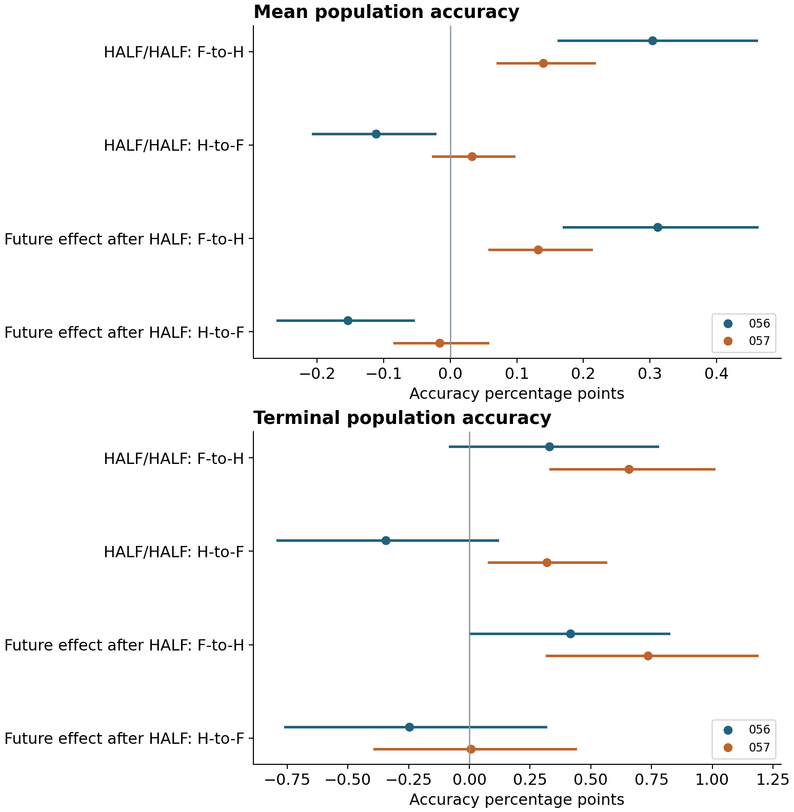

Figure 13. Mean and terminal population-accuracy effects, reported separately from founder transmission. HALF/HALF denotes the base substitution comparison; the future contrast holds HALF preparation fixed and compares future HALF with ZERO. The two cohorts are displayed separately and all intervals are pointwise.

### The future contribution persists under one interacting objective

Study 058 supports its fixed primary direction: future HALF instead of ZERO increases the TRAP4 matched F-to-H founder effect by **+23.74 [+17.26, +30.23] percentage points**. This is +7.60 [+5.52, +9.67] additional expected descendants for the difference between matched effects. Its lower interval exceeds the separately specified one-descendant benchmark. These are average intervention effects, not a typical introduction's realized descendants.

The contemporaneous Hamming future effect is +17.82 [+12.41, +23.67] points. The direct paired TRAP4-minus-Hamming contrast is **+5.92 [-1.06, +13.13] points and unresolved**. Thus this experiment extends the conditional recurrence finding to one interacting objective, but does not establish that coordinate interactions increase its magnitude. Both the prepared populations and score distributions change across objectives; the comparison does not identify epistasis alone as a mediator.

| TRAP4 founder quantity | Percentage points [95% interval] |
|---|---|
| Future HALF-minus-ZERO, matched F-to-H effect | +23.74 [+17.26, +30.23] |
| Future HALF, matched F-to-H effect | +21.88 [+16.48, +27.62] |
| Future HALF, absolute introduced-H change | +21.56 [+16.57, +26.75] |
| Future ZERO, matched F-to-H effect | -1.86 [-4.39, +0.37] |
| Future HALF, matched H-to-F effect | -3.91 [-5.71, -2.34] |
| Future ZERO, matched H-to-F effect | +3.18 [+0.52, +6.02] |

Under HALF, the separate base comparison and absolute introduced-H change are positive. Under ZERO, the matched F-to-H comparison remains unresolved, so a beneficial-to-harmful F-to-H reversal is not established for TRAP4. The primary has 90 positive, 12 negative and 90 tied paired continuations; 22 block means are positive and two negative. The two HALF F-to-H placements lose 141/192 and 143/192 founders, with 46 and 41 fixations and five and eight polymorphic endpoints. Placements are dependent. Every introduced F founder disappears at both placements under HALF in both objectives, despite the opposite H-to-F advantage under TRAP4 ZERO. Sampled extinction is not proof that establishment is impossible.

For TRAP4 HALF, F-to-H improves mean population objective utility by +0.21 [+0.12, +0.30] utility points and terminal utility by +0.53 [+0.02, +1.02]. These endpoint-specific population effects are distinct from founder transmission. Reciprocal H-to-F mean and terminal utility effects are unresolved: +0.03 [-0.03, +0.10] and +0.10 [-0.28, +0.49]. The positive reciprocal terminal-accuracy result in 057 is not reproduced as a positive interval here, but no formal between-study difference is tested. All 114 estimates are retained: 66 positive, ten negative and 38 unresolved, with pointwise rather than family-wide coverage.

Figure 14. Study 058 changes the objective throughout initial preparation, resident-policy preparation and transfer. The lower TRAP4 future-law row is the primary; its short black benchmark marks one expected descendant. The direct objective interaction, bottom row, remains unresolved. The two objective arms use paired new inputs. Their shared nominal range does not isolate epistasis or equalize selection intensity.

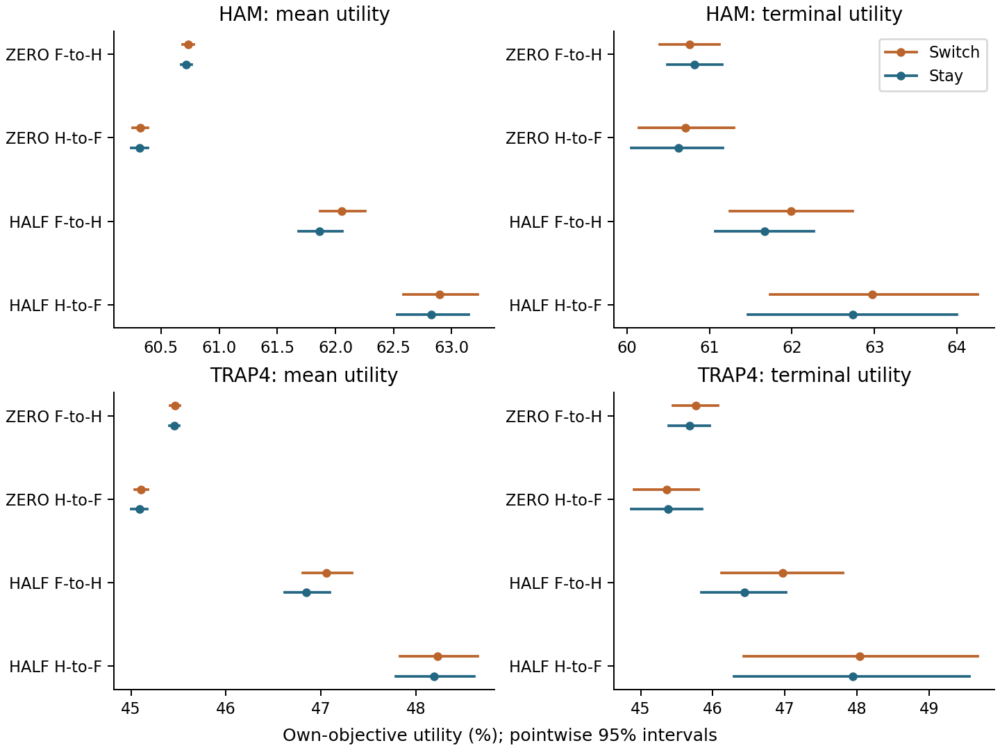

Figure 15. Both switched and unchanged population arms are shown, separately for mean and terminal utility. Each objective has its own utility definition and axis scale; the plotted levels must not be read as a cross-objective performance ranking. Overlap between separate arm intervals is not a test of the paired effect. Approximate intervals are pointwise.

### A one-update pulse leaves population benefit unresolved

Study 059's fixed primary is **unresolved**: PULSE-minus-STAY terminal population accuracy is **+0.037 [-0.247, +0.336] percentage points**. This is +0.383 [-2.526, +3.436] expected matching bits across the whole population. The interval spans both zero and the one-bit benchmark. The data establish neither a lasting benefit nor no effect or practical equivalence. Post-pulse mean accuracy over updates 2-40 is also unresolved, +0.005 [-0.049, +0.063] points, as is the whole-path mean, +0.004 [-0.048, +0.061] points.

The continuous-F comparator also has an unresolved terminal accuracy contrast, +0.100 [-0.304, +0.537] points relative to STAY. Pulse-minus-continuous terminal accuracy is -0.063 [-0.258, +0.124] points and unresolved. Thus the positive terminal-accuracy interval in study 057 is not reproduced as a positive interval on these new transfer inputs. This is not a formal between-study difference test, and the prepared populations are reused.

Founder transmission gives a separate temporal result. The identical first update of pulse and continuous expression causes a matched founder-frequency change of -0.724 [-1.042, -0.366] points relative to STAY. At update 40, pulse-minus-continuous founder representation is **+2.995 [+1.465, +4.688] points**, positive. Restoring historical retrieval after the common first step therefore increases later founder representation relative to allowing continued fresh expression. This secondary result does not replace the unresolved population primary or demonstrate a pulse advantage over all-H: the pulse-minus-STAY founder contrast is -2.344 [-4.737, +0.057] points and unresolved, while continuous-minus-STAY is -5.339 [-7.300, -3.499] points and negative.

| Matched terminal contrast | Population accuracy, pp [95% interval] | Founder representation, pp [95% interval] |
|---|---|---|
| Pulse minus unchanged H | +0.037 [-0.247, +0.336] | -2.344 [-4.737, +0.057] |
| Continuous F minus unchanged H | +0.100 [-0.304, +0.537] | -5.339 [-7.300, -3.499] |
| Pulse minus continuous F | -0.063 [-0.258, +0.124] | +2.995 [+1.465, +4.688] |

Founder loss remains frequent. The pulse loses 185/192 and 187/192 focal lineages at its two placements, with six and five fixations; continuous F loses 191/192 at each placement, with one polymorphic survivor at each. These two survivors are retained and differ from study 057's sampled all-loss outcome. Forced zero F expression after the pulse is a design identity, not observed extinction of founder ancestry. Neither inference nor reporting conditions on survival. The primary contains 68 positive, 66 negative and 58 tied replicate contrasts; its block signs split 12 positive and 12 negative.

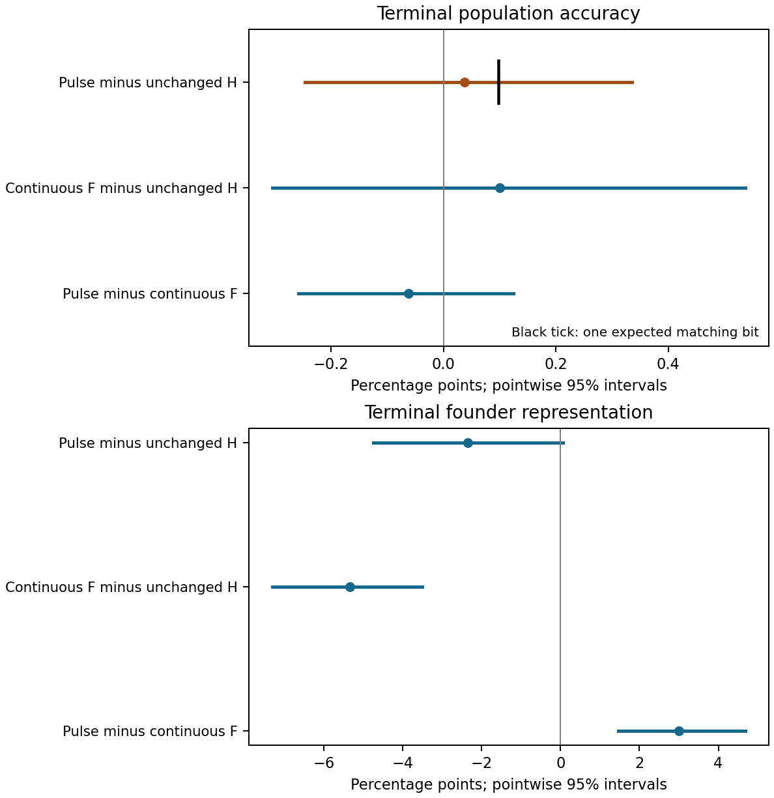

Figure 16. Study 059 compares a one-update F pulse, continuous F expression and unchanged H. The first row of the upper panel is the fixed population-accuracy primary; the black tick marks one expected additional matching bit across the population. The lower panel measures founder ancestry regardless of current policy. Restoring H improves ancestry relative to continued F, while every displayed accuracy contrast remains unresolved. Intervals are approximate and pointwise. The same prepared states are reused, with new paired transfer inputs; placements are averaged before block inference.

### A founder recurrence effect under noisy measurements, with population costs

The fixed attenuation primary is **unresolved**: the noise-by-recurrence interaction on the matched H-founder effect is **+1.636 [-2.604, +5.656] percentage points**, or +0.523 [-0.833, +1.810] expected descendants. Its interval crosses zero and the positive one-descendant scale, while lying above minus one descendant. Neither attenuation nor enhancement is established, and the result is not evidence of equality or practical equivalence.

The HALF-minus-ZERO matched founder effect is **+19.100 [+14.217, +23.902] points under exact measurement** and **+20.736 [+15.591, +26.246] points under noisy measurement**. Both intervals exceed the positive one-descendant benchmark. Thus the recurrence-related founder effect remains demonstrable in this one bounded-error transfer setting. The primary remains unresolved; noise invariance is not established.

Population objective utility supplies an adverse companion. Noise reduces mean true accuracy in both the H-introduction and all-F arms under both future laws:

| Noise minus exact measurement | H-introduction mean accuracy, pp [95% interval] | All-F mean accuracy, pp [95% interval] |
|---|---|---|
| ZERO future | -0.129 [-0.167, -0.092] | -0.162 [-0.213, -0.111] |
| HALF future | -0.203 [-0.262, -0.144] | -0.271 [-0.334, -0.204] |

Within HALF, H introduction still increases mean accuracy relative to its matched all-F control: +0.163 [+0.101, +0.234] points with exact measurement and +0.230 [+0.141, +0.327] points with noisy measurement. Corresponding terminal-accuracy effects remain unresolved: +0.213 [-0.140, +0.549] and +0.190 [-0.148, +0.527] points. ZERO introduction effects and all four terminal noise effects on absolute arm accuracy are also unresolved. The noise-by-recurrence population interactions are +0.035 [-0.038, +0.111] points for mean accuracy and -0.296 [-0.677, +0.101] points at the terminal target, both unresolved. These distinctions prevent founder transmission from standing in for population benefit.

Founder loss remains frequent: HALF H introductions lose 144/192 and 155/192 lineages at the two exact-measurement placements, and 143/192 and 148/192 under noise. ZERO loses 186/192 and 188/192 under exact measurement, and 186/192 and 189/192 under noise. All founders enter inference; no estimate conditions on survival. The primary has 56 positive, 52 negative and 84 tied replicate contrasts, with 12 positive and 12 negative block contrasts. The placements are paired and do not constitute independent cohorts.

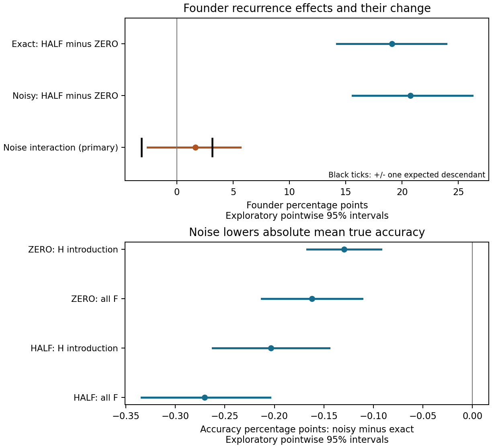

Figure 17. The upper panel shows exact and noisy recurrence-related founder effects and their direct interaction; the orange row is the unresolved primary. The short black ticks on that row mark plus or minus one expected descendant, not equivalence limits. The lower panel shows the four adverse effects of noise on mean true population accuracy. Each mean and interval is bound to a saved study 060 estimate. Axes distinguish founder from accuracy percentage points. Intervals are approximate and pointwise; preparations are reused from 057. A positive noisy founder effect coexists with lower population accuracy under noise.

## Local mathematics and interpretation

For two fixed n-bit candidates at distance d and an independent uniform target, each candidate has expected unselected mismatch n/2. Selecting the better candidate improves that expectation by g(d) = 2^(-d) sum over j of binomial(d,j) max(2j−d,0). Thus a historical alternative can provide a local selection opportunity even without predictive target information. Matching d fixes this ideal two-candidate expectation and the mismatch covariance (n−2d)/4.

It does not fix global selection. A two-bit counterexample uses parents 00,00 and probes 01,01 in one pool versus 01,10 in another, with four common background candidates 00,00,00,01. Every parent–probe distance is one. Selecting the best two of eight candidates and averaging across uniform targets gives expected mean mismatch 1/2 versus 3/8. The exact difference is 1/8 bit despite equal local pair distances and expectations. Complete rational checks are supplied in the analytical notes. These calculations concern fixed candidates and pools, not target-dependent local descendants, inheritance or multigeneration propagation. They establish limits on a proposed inference, rather than predicting the observed population ranking.

## Discussion

The central finding is that the transmission value of an available memory-use policy depends on environmental recurrence, initial population state and the comparator. One component is a repeated conditional reversal between two ways of allocating an existing carrier's candidate slot. Historical retrieval beats fresh variation in mean carrier change under exact recurrence and loses under independent targets. A subsequent known-cohort intervention retains a carrier advantage under intermittent recurrence, while exposing a negative terminal-accuracy contrast. Finite preparation strengthens the recurrent contrast; the distance restriction shows that historical placement matters beyond one local distance statistic in this model. These interventions do not establish that organized variation is universally beneficial, that memory originates spontaneously, or that a costly modifier generally invades an equilibrated population.

Study 058 extends the future-recurrence finding to one fixed interacting objective. It neither establishes a general ruggedness advantage nor isolates an interaction mechanism: the direct paired objective contrast is unresolved, and objective-specific preparation and score distributions both change. Founder transmission and normalized objective utility remain separate outcomes.

Study 059 separates a temporary policy expression from later founder ancestry by restoring H after an identical first update. The restoration increases terminal founder representation relative to continued F, but the pulse population-accuracy primary, its benchmark and the continuous comparator remain unresolved. This bounds any inference that fresh exploration benefits the population after its expression ends. It does not identify a unique genotype/cache mediator or establish a general exploration schedule.

Study 060 challenges exact transfer measurement rather than adding recurrence levels. The founder recurrence contrast remains positive with bounded one-bit error, but the direct noise interaction is unresolved and absolute mean true accuracy declines. Noise acts on both donor and survivor decisions, so the study does not identify either as a unique mediator. Its exact-observation preparations are reused; robustness to noisy preparation, other error magnitudes or error laws remains open.

The limitations are substantive. Selection is global; the original deterministic rule and one fixed probabilistic alternative leave many other survival conventions untested, the population and horizon are small and fixed, the temporal target processes remain narrowly specified, and costs use an uncalibrated score penalty. Introductions usually disappear, including in favorable zero-cost groups. Bootstrap uncertainty is pointwise, and several studies deliberately reuse accepted states and random streams. Study 046 supplies an independent cohort for the original ranking reversal, and study 052 independently prepares the later direct-competition cohort. Studies 053–056 reuse the latter genotype cohort; their new continuations do not create additional independent preparation cohorts. Study 056 isolates a future-law contribution within that cohort. Study 057 supplies a new-cohort test of its fixed direction, using the same model and code; it does not establish a universal magnitude or robustness to other model assumptions. The later 058 objective challenge supplies a separate, limited robustness result, without pooling cohorts. The distance control does not preserve the whole joint distribution of candidate pools, and no local statistic identifies the unique mechanism of a total population effect.

The two tested costs do not exhaust every positive real cost. A conditional sensitivity proof for ideal continuous-uniform survival shows that a strictly positive true zero-cost expectation persists for sufficiently small costs, without supplying a consequential cost scale. A separate coupling argument bounds the structural trajectory-law difference between continuous clocks and exact-arithmetic 52-bit grid clocks by 1.444×10^−10 for 128 candidates and 40 updates, uniformly over positive weights. Combining the bounds gives an explicit nonzero error floor; it does not imply continuity of the grid law. Library logarithms, floating-point ordering and pseudorandom-generator assumptions remain outside that certification. These are mathematical results, not new positive-cost population evidence; sampled means cannot be substituted for a proven true expectation.

The scientific contribution should be assessed against established dynamic-optimization and inherited-information models. Its scope is an explicit accounting of strategy transmission, population performance, initial state, historical placement and cost within one auditable finite-budget assay. Computational verification supports the accuracy of those outcomes; it does not establish broader biological relevance or publication novelty. The imperfect-recurrence challenge broadens the temporal scope within the same model; its lower terminal accuracy narrows any claim of collective benefit. The probabilistic-survival challenge retains the intermittent carrier advantage but reduces it under full recurrence; it supplies no independent preparation replication. The direct-competition challenge extends the intermittent ranking to two strategies sharing one population, but does not isolate competitor identity from carrier density. A new independent-preparation cohort reproduces the three fixed direct-competition predictions, while retaining frequent loss, costly negative averages and terminal uncertainty. Fixed-density common-competitor controls preserve both focal advantages while exposing negative total-carrier nonadditivity. The full-carrier experiment supports a finite-horizon rare-H increase under recurrence, and the final resident-policy experiment retains the matched H-use advantage after finite preparation. Renewed targets support an opposite H-to-F substitution benefit in the H-prepared background, and both study-055 partial-recurrence terminal performance effects remain unresolved. The crossed continuation adds a future-recurrence contribution at fixed prepared populations. The new-cohort test reproduced the prespecified positive directional criterion; its evidence is retained separately from the exploratory original. F-to-H preparation moderation remains unresolved in both cohorts. The reciprocal interaction is positive in 056 and unresolved in 057; differing significance labels do not establish heterogeneity. The new cohort also retains a negative H-to-F founder effect alongside improved terminal population accuracy. These outcomes do not identify a unique mediator. Finite preparation and conditional average growth do not establish equilibrium invasibility or evolutionary stability.

## Reproducibility and availability

The [version 1.4.0 release](https://github.com/jackchenx3/private-memory-recurrence/releases/tag/v1.4.0) and its [version DOI](https://doi.org/10.5281/zenodo.22949032) include study 060's 81 estimates, compact time series, frozen block resamples, source and seed provenance, founder fates, adverse outcomes and one source-bound figure. The unified saved-table checker covers 15,284 estimates through 060. This aggregate check is distinct from the completed supervisor reconstruction of all 81 additions and the prospectively selected 96 raw paths in block zero. The 167-file full scientific delivery is separately hash-verified locally and on HPC. The compact export omits raw candidate trajectories and random tapes; administrative transformations and format-only projections are recorded. [Public version 1.3.0](https://doi.org/10.5281/zenodo.22939403) and all earlier versions remain unchanged.

The compact release supports verification from block aggregates, figure rebuilding, and source inspection. It does not include the multi-gigabyte raw candidate-by-candidate trajectory and random-tape archives. Those remain in the project archive; the present package is not represented as a self-contained raw-trajectory replay. Independent saved-record reconstruction of study 055 checked all 1,152 new preparations and 3,456 transfers, all 624 study-specific intervals, and the retained contrary outcomes. That earlier computational check is reported as provenance, not a new replication performed by a reader of this compact release.

The manuscript and data are released under CC BY 4.0; original code is released under MIT. Dependencies retain their own licenses. This preprint is not externally peer reviewed. Its contribution is a model-specific comparative result, not a field-wide novelty or priority claim.

## AI assistance and accountability

ChatGPT and Codex assisted with hypothesis refinement, study specifications, implementation, computational checking, analysis and writing under the author's direction. Implementation and review were performed in separate agent tasks. These checks reduce some computational errors but are not external peer review or evidence that the agents' reasoning and assumptions are independent. AI systems are not listed as authors. The public package preserves unfavorable outcomes, reuse boundaries and identified implementation corrections. The human author is responsible for the public work; no claim of an unrecorded human replication is made.

## References

1. Branke J. Memory enhanced evolutionary algorithms for changing optimization problems. Proceedings of the 1999 Congress on Evolutionary Computation, pp. 1875–1882. [doi:10.1109/CEC.1999.785502](https://doi.org/10.1109/CEC.1999.785502). [Author manuscript](https://www.macs.hw.ac.uk/~dwcorne/RSR/memory.pdf).
2. Yang S. Genetic algorithms with memory- and elitism-based immigrants in dynamic environments. Evolutionary Computation 16(3), 385–416 (2008). [doi:10.1162/evco.2008.16.3.385](https://doi.org/10.1162/evco.2008.16.3.385). [Author manuscript](https://www.cs.le.ac.uk/people/syang/Papers/EVCO08.pdf).
3. Kuijper B, Johnstone RA. Parental effects and the evolution of phenotypic memory. Journal of Evolutionary Biology 29(2), 265–276 (2016). [doi:10.1111/jeb.12778](https://doi.org/10.1111/jeb.12778). [Abstract and bibliographic record](https://pubmed.ncbi.nlm.nih.gov/26492510/).

[Supporting information](SUPPLEMENT.md) · [Study 056 estimates](../results/056/ESTIMATES.json) · [Study 057 estimates](../results/057/ESTIMATES.json) · [Added source statistics](../results/QUOTED_056_057_STATISTICS.json)

[Study 058 estimates](../results/058/ESTIMATES.json) · [New quoted statistics](../results/QUOTED_058_STATISTICS.json)

[Study 059 estimates](../results/059/ESTIMATES.json) · [New quoted statistics](../results/QUOTED_059_STATISTICS.json)

[Study 060 estimates](../results/060/ESTIMATES.json) | [Study 060 quoted statistics](../results/QUOTED_060_STATISTICS.json)
